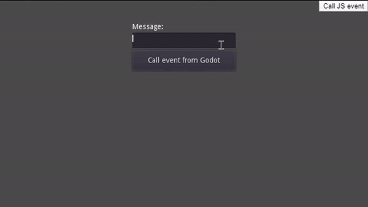

# Godot - JS gateway

IMPORTANT: This branch is supporting Godot 4. If you need Godot 3 compatible version - checkout old branch: [legacy-godot-3](https://github.com/Ajver/godot-js-gateway/tree/legacy-godot-3)

A gateway that helps communicate between Godot app exported as HTML5 and JS application, that holds the Godot app.

It's made via one singleton script: GodotGateway, and one helping singleton: JS_API, that provides some functions for better communication with JavaScript.

All code is based on the JavaScript singleton from official Godot Engine: [read the docs](https://docs.godotengine.org/en/stable/classes/class_javascriptbridge.html)

## Instalation

To install this module into your Godot app follow these steps:

1. Copy the folder src/GodotGateway into your project. Paste it inside `res://src` directory. If you choose different directory, you need to update the absolute path pointing to `GodotGateway.js` file, which is mentioned in `GodotGateway.gd`.
2. Go to Project -> ProjectSettings -> Autoload and load 2 scripts as singletons:
   1. `src/GodotGateway/GodotGateway.gd`
   2. `src/GodotGateway/JS_API.gd` - make sure to set the name for that singleton as `JS_API`!
3. Go to Project -> Export and edit your Web export preset to include JS files: in Resources tab add `*.js` filter to Export as non-resource file. This will ensure the GodotGateway.js and other javascript files are included in the build

That's it! Now read next section to know how to use it...

## Usage

### Sending events from Godot -> JavaScript

From Godot project you can send events to JS by calling: `GodotGateway.new_event` method with 2 parameters:
  1. Event name (String)
  2. Event data (String)

i.e.:

```gdscript
GodotGateway.new_event("test", "foo")
```

Now to receive this event on JS side, create new JS file (inside Godot project directory), i.e. in: `res://src/JS/test.js` path.

In the JS file add event listener:
```javascript
document.gatewayToJS.addEventListener("test", data => {
  alert("This event came from Godot end: " + data);
})
```

And execute this JS file from Godot application, by calling:

```gdscript
JS_API.eval_file("res://src/JS/test.js")
```

Make sure to run the `eval_file` command BEFORE creating a `new_event`! (ideally in `_ready` function)

### Sending events from JS -> Godot

First create a JS file, that will send the event to Godot, and store this file in the project tree. i.e.: `res://src/JS/test.js`

In Godot, make sure to call `JS_API.eval_file("res://src/JS/test.js")` with the JS file path, to execute the file's content! Do this in main `_ready` function, so that it is called only Once!

Inside this JS file write:

```javascript
document.gatewayToGodot.newEvent("msg_from_js", "Example content");
```

On Godot end write code to handle this event:

```gdscript
func _ready():
	GodotGateway.add_event_listener("msg_from_js", self, "handle_msg_from_js")

func handle_msg_from_js(content: String):
	print("This message came from JS end: ", content)
```

## Demo

